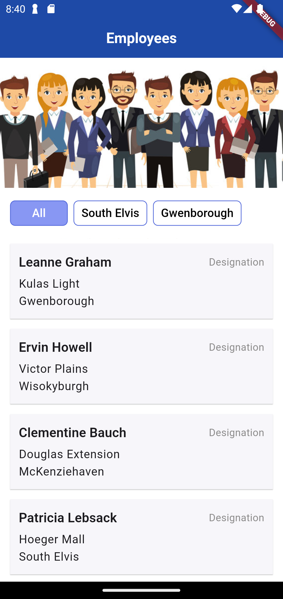
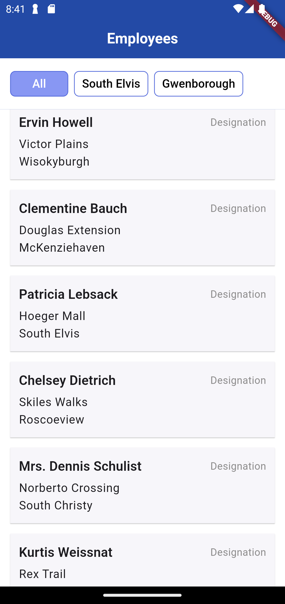
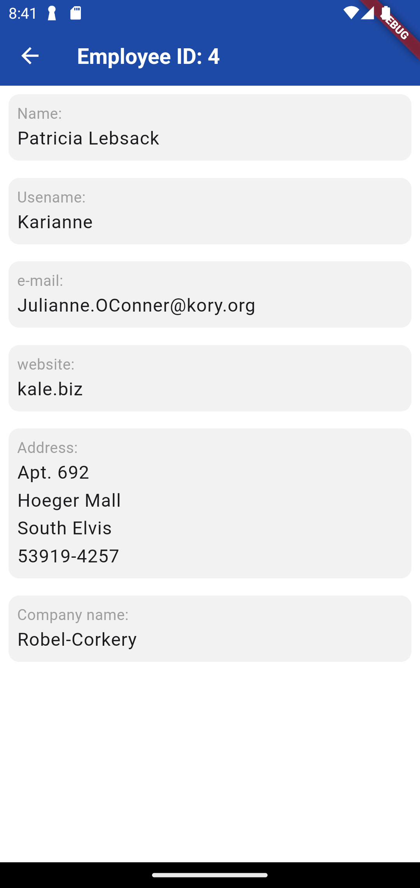

# toobler_flutter_test

A Machine test for the flutter developer position at Toobler

## Tools and Technologies used
- Flutter
- Bloc for state management
- Clean architecture
- VS code IDE

## ScreenShots

1. Initial Screen

2. Scrolling

3. Filter

4. View details Screen

